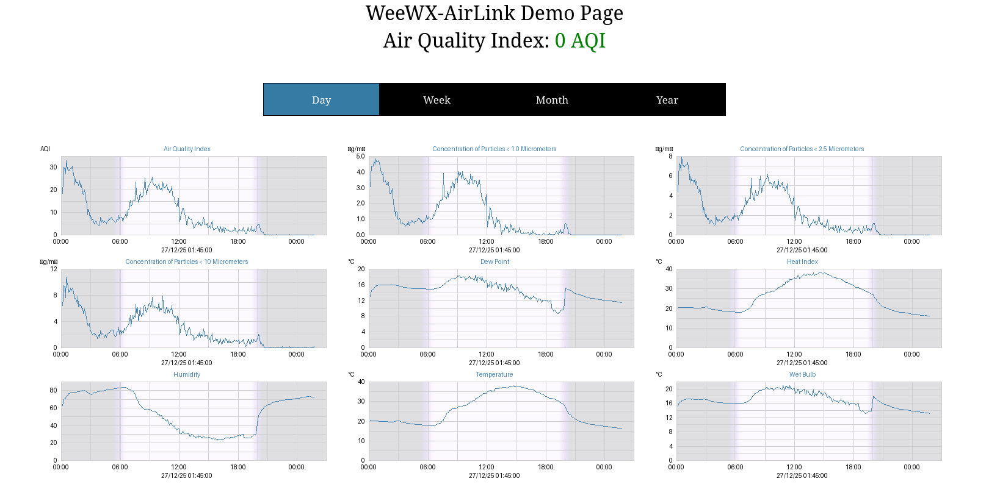

# weewx-airlink
Open source plugin for WeeWX software.

## Description

A WeeWX plugin that gets its AirLink sensor readings either directly
from the AirLink sensor.

Copyright (C)2020-2024 by John A Kline (john@johnkline.com)

Forked and extended in December 2025.

**This plugin requires Python 3.7, WeeWX 5**

weewx-airlink requires the following columns in your database. The wview
extended schema doesn't have all columns that can be used to store all
the data of all the sensors available in the Airlink 7210 and it's better
to tune your database to only have the columns you are actually using
and not have 50+ columns in the archive table full of nothing but nulls.

| Name                    | Type  |
| ----------------------- | ----- |
| airlink_dew_point       | float |
| airlink_heat_index      | float |
| airlink_hum             | float |
| airlink_temp            | float |
| airlink_wet_bulb        | float |
| pm1_0                   | float |
| pm1_0_1m                | float |
| pm2_5                   | float |
| pm2_5_1m                | float |
| pm2_5_aqi               | float |
| pm2_5_aqi_color         | int   |
| pm2_5_nowcast           | float |
| pm2_5_nowcast_aqi       | float |
| pm2_5_nowcast_aqi_color | int   |
| pm10_0                  | float |
| pm10_0_1m               | float |
| pm10_0_nowcast          | float |

You can easily add just the columns you need by using the weectl program

```bash
weectl database add-column --type float airlink_dew_point
weectl database add-column --type float airlink_heat_index
weectl database add-column --type float airlink_hum
weectl database add-column --type float airlink_temp
weectl database add-column --type float pm1_0
weectl database add-column --type float pm1_0_1m
weectl database add-column --type float pm2_5
weectl database add-column --type float pm2_5_1m
weectl database add-column --type float pm2_5_aqi
weectl database add-column --type int   pm2_5_aqi_color
weectl database add-column --type float pm2_5_nowcast
weectl database add-column --type float pm2_5_nowcast_aqi
weectl database add-column --type int   pm2_5_nowcast_aqi_color
weectl database add-column --type float pm10_0
weectl database add-column --type float pm10_0_1m
weectl database add-column --type float pm10_0_nowcast
```

If you don't specify the column type double will most likely be used which
uses 8 bytes per value, where as float and int numbers only need 4 bytes
per value which really start to add up over time.

A skin is provided to show a sample report:


# Installation Instructions

  * WeeWX 5
  * Python 3.7 or greater

## WeeWX 5 Installation Instructions

1. You need an installed and working copy of weeWX

1. Install the dateutil and requests packages if you don't have them already

   ```bash
   sudo apt update && sudo apt -y install python3-dateutil python3-requests
   ```

1. Download the lastest master version of weewx-airlink.zip
   ```bash
   wget -O weewx-airlink-master.zip https://github.com/evilbunny2008/weewx-airlink/archive/refs/heads/master.zip
   ```

1. Install the airlink extension.

   ```bash
   weectl extension install weewx-airlink-master.zip
   ```

1. Edit the `AirLink` section of weewx.conf (which was created by the install
   above).  In particular, change the hostname in the section labeled Sensor1 to
   be a name resolvable to the IP address of an AirLink sensor or the IP address
   of an AirLink sensor.  More sensors can be specified.  For example, to add
   a second AirLink sensor, enable the Sensor2 section and specify the hostname.
   There is no limit to how many sensors can be configured; but the numbering must
   be consecutive.  The order in which sensors are interrogated is low numbers to
   high.  Once a sensor replies, no further sensors are interrogated for the current
   polling round.

   Note: The port can be specified because this extension also works with the
   [airlink-proxy](https://github.com/chaunceygardiner/airlink-proxy) service.
   That service typcially uses port 8000.

   ```yaml
   [AirLink]
       extra_verbose = false
       [[Sensor1]]
           enable = true
           hostname = 192.168.0.50
           port = 80
           timeout = 5
       [[Sensor2]]
           enable = false
           hostname = 10.5.5.5
           port = 8000
           timeout = 5
   ```

 **Note: This forked version allows you to stop the deluge of logging by default,
         which may be useful for debugging, however once running if you don't limit the
         logging by setting extra_verbose = false your logs will fill up in no time**

1. Restart WeeWX

```bash
  systemctl restart weewx.service
```

1. To check for a successful install, simply check journald for errors

```bash
journalctl -n 100 -u weewx.service
```

1. After waiting for a reporting cycle, you can then
   navigate in a browser to the WeeWX site and add /airlink to the end
   of the URL (e.g., http://weewx-machine/weewx/airlink).
   The various graphs will fill in over time.

# How to access weewx-airlink fields in reports.

Note: Although the examples below show the use of $current, aggregates are also
supported (e.g., the high PM2.5 for the week can be presented with `$week.pm2_5.max`.

To show the PM2.5 reading, use the following:
```
$current.pm2_5
```

To show the Air Quality Index:
```
$current.pm2_5_aqi
```

To get the RGBINT color of the current Air Quality Index:
```
#set $color = int($current.pm2_5_aqi_color.raw)
#set $blue  =  $color & 255
#set $green = ($color >> 8) & 255
#set $red   = ($color >> 16) & 255
```

To show the PM1.0 reading, use the following:
```
$current.pm1_0
```

To show the PM10.0 reading, use the following:
```
$current.pm10_0
```

## Licensing

weewx-airlink is licensed under the GNU Public License v3.
